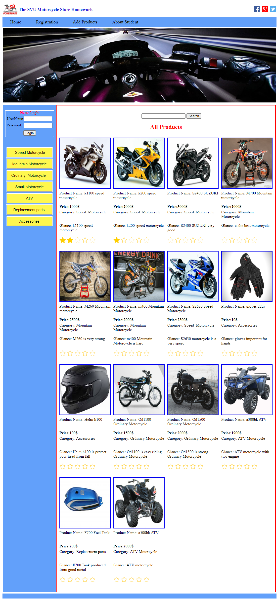
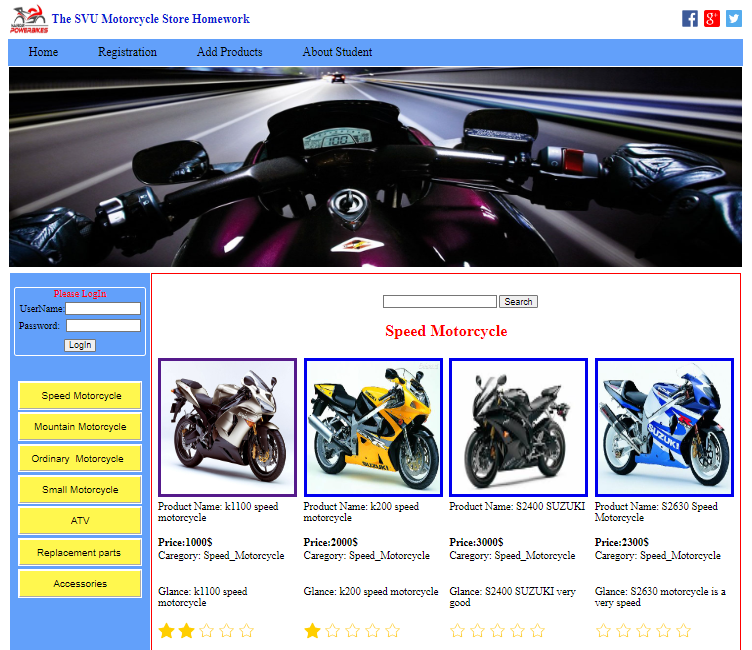
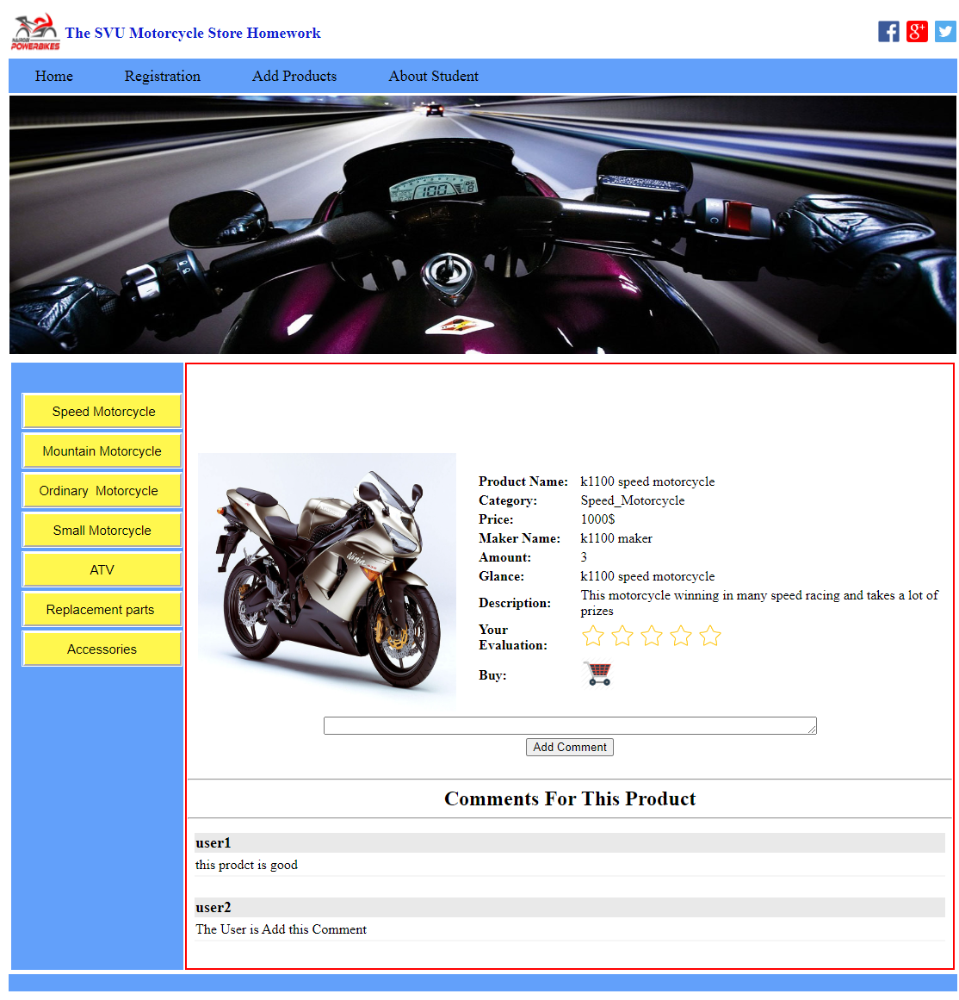
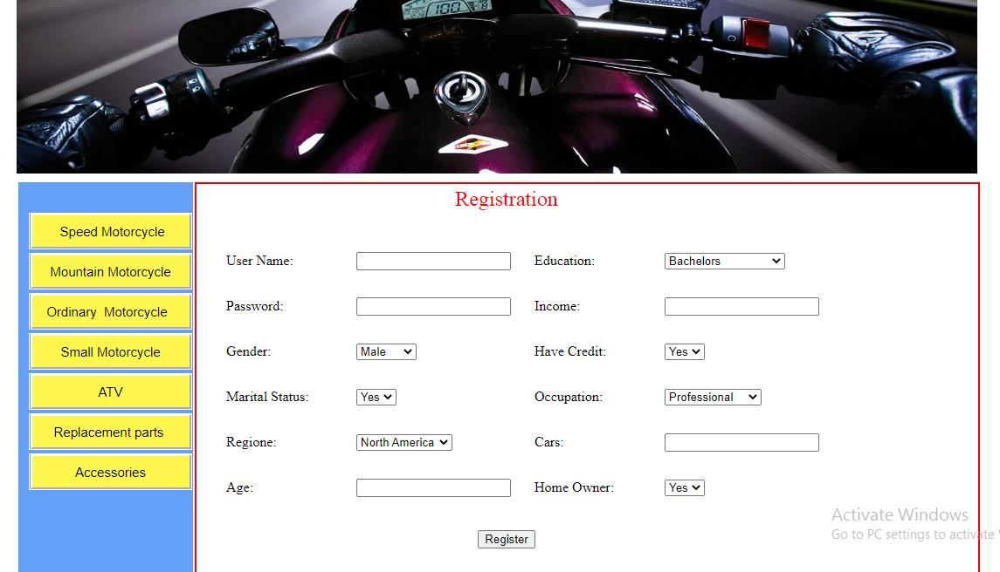

# Motorrad-E-Commerce-Website – ASP.NET C#

##  Projektübersicht
Dieses Projekt ist eine webbasierte E-Commerce-Anwendung zum Kauf von Motorrädern.
Es wurde im Rahmen meines Masterstudiums im Bereich Web Science entwickelt und
konzentriert sich auf die Backend-Entwicklung mit C# und ASP.NET.

Die Anwendung ermöglicht es Benutzern, Motorräder zu durchsuchen, nach Typ zu
filtern und Produkte zu bewerten, während Administratoren Produkte über einen
geschützten Admin-Bereich verwalten können.

---

##  Technologien
- C#
- ASP.NET
- Entity Framework
- SQL Server / MySQL
- HTML, CSS, JavaScript

---

##  Funktionen

###  Benutzerfunktionen
- Registrierung und Anmeldung von Benutzern
- Anzeige und Durchsuchen von Motorrädern
- Filterung nach Motorradtyp / Kategorie
- Produktsuche
- Produktbewertung mit Sternen ⭐
- Detailansicht der Produkte
- Kommentieren

###  Administratorfunktionen
- Administrator-Login
- Hinzufügen neuer Motorräder
---

## Screenshots

### Startseite

### Motorrad durch Kategorie

### Produktdetails & Bewertung

### Regesteration

---

## Akademischer Kontext
Dieses Projekt wurde im Rahmen meines Masterstudiums entwickelt und dient zur
Demonstration praktischer Kenntnisse in der ASP.NET-Backend-Entwicklung.

---

##  Autor
Ali Adulhameed /2017  

